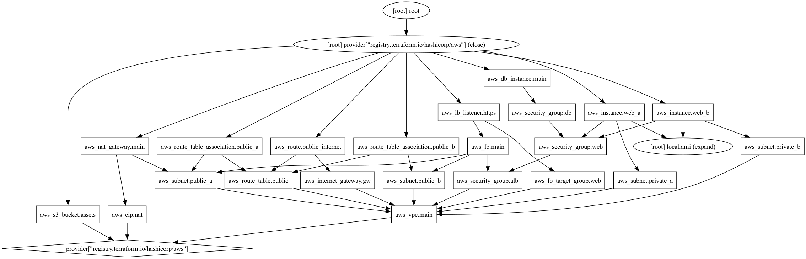
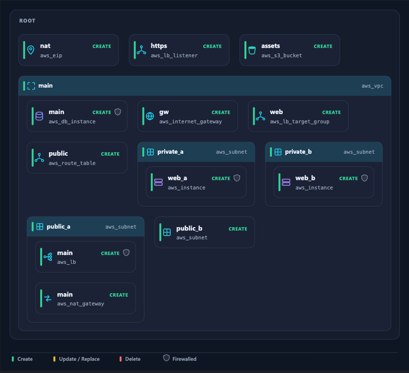

# Planar

**Living architecture diagrams from your Terraform plans — beautiful infra diffs, straight into your PRs.**

Planar turns the output of `terraform plan` into clean, grouped, executive-ready architecture diagrams. It abstracts away plumbing (IAM attachments, route associations, glue resources), groups what's left into logical containers, and shows you the diff: green for created, red for destroyed, orange for changed.

> Status: pre-release. The engine is complete — parsing, logical grouping, ELK layout, and themed SVG rendering (light/dark) all work end to end. The GitHub Action (M3) is next.

## See it

**Before** — `terraform graph | dot` on a real plan:



**After** — the same plan, drawn by Planar:



## Why plan JSON, not `.tf`

Planar reads the resolved plan (`terraform show -json`), not raw HCL. That's the only way to get an accurate diff and to see resources fully expanded through `count`, `for_each`, and modules. The engine is a pure transform — it never runs Terraform or touches your credentials. Your CI pipeline produces the plan; Planar draws it.

## What it does

- **Pure transform.** Reads plan JSON; never runs Terraform or sees your credentials.
- **Abstracts plumbing.** Drops no-ops and glue resources (IAM attachments, route-table associations, and similar) so the diagram shows architecture, not wiring.
- **Groups logically.** Nests resources into containers using the plan's real references (subnet → VPC, instance → subnet), falling back to per-provider heuristics when a plan has no config block.
- **Demotes security groups.** Folds security groups, NSGs, and firewalls into a shield badge on the resources they protect — conservatively, so a *changed* group is never silently dropped.
- **Reads as architecture.** House-style monoline glyphs per resource type; unmapped types degrade to a per-category glyph and color instead of a blank box, so real plans don't become a sea of gray squares.
- **Provider-general.** Pipeline works across providers; AWS coverage is deepest, with Azure and GCP riding the shared category layer.
- **Shows the diff.** Green create, orange update/replace, red delete, with a baked-in legend.
- **Light and dark themes.**


## Quickstart

```bash
pnpm install

# Produce a plan document from any Terraform project:
#   terraform plan -out tfplan.bin
#   terraform show -json tfplan.bin > plan.json

# Render an SVG (the richer fixture has a configuration block,
# so it exercises reference-based grouping and SG demotion):
pnpm cli test/fixtures/aws-3tier.plan.json diagram.svg
pnpm cli test/fixtures/aws-3tier.plan.json diagram.dark.svg --dark

# Omit the output path to print the grouped hierarchy instead:
pnpm cli test/fixtures/aws-basic.plan.json

pnpm test
```

With no output path, the CLI prints the grouped hierarchy that the layout step consumes:

```
planar: 7 resource(s) across 2 group(s)

[root]
  + create  aws_vpc.main  (aws)
    + create  aws_subnet.public  (aws)
      + create  aws_instance.web  (aws)
    ~ update  aws_security_group.web  (aws)
    ± replace aws_db_instance.main  (aws)
  - delete  aws_s3_bucket.legacy  (aws)

[module.networking]
  + create  aws_nat_gateway.main  (aws)
```

## Roadmap

- [x] **M1** — Parse `terraform show -json` into a typed IR; prune plumbing; normalize status (incl. replace).
- [x] **M1.5** — Logical grouping: nest related resources into a container tree (e.g. instance → subnet → vpc) via plan references and per-provider heuristics.
- [x] **M2** — ELK hierarchical layout + themed SVG (light/dark) with house-style iconography and per-category fallback; security-group demotion; diff styling with a legend.
- [ ] **M3** — GitHub Action: post the diff on PRs, commit/update the SVG and README on merge.

## Known limitations & TODO

**Post-launch**

- **Multi-provider depth.** The pipeline is provider-general and verified on Azure, but coverage is AWS-first: bespoke glyphs are AWS-only (Azure/GCP fall back to per-category glyphs, so distinct network kinds can share a glyph), some keywords are missing (e.g. `azurerm_public_ip` lands in "other"), Azure resource-group containment isn't modeled, and GCP is seeded but untested. Add Azure/GCP fixtures and tests to lock it in.
- **Layout polish.** Dead-space tuning in sparse diagrams, and legibility on very large plans (100+ resources).

## License

MIT
